<div align="center">

# 🏨 Stayora


### A full-stack accommodation booking platform with Guest, Hotel Owner and Admin experiences

[](https://stayora-mocha.vercel.app)


**[🌐 Live Demo](https://stayora-mocha.vercel.app)** · **[🐞 Report a Bug](https://github.com/Bhartendra-singh/Stayora-An-Accommodation-Booking-Platform/issues)**


*Originally built as WanderLust and renamed Stayora. Some UI screens still show the old name.*

</div>

> ⏳ **Heads up:** the backend runs on a free tier and sleeps after 15 minutes of inactivity. The first request after a break can take 30 to 50 seconds. Open the live demo, wait a moment, and refresh.

---

## 📸 Screenshots

### Guest experience

| Home | Featured Destinations |
|---|---|
| 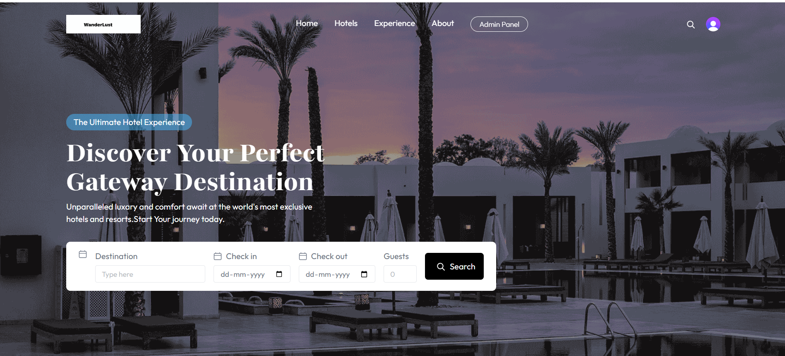 | 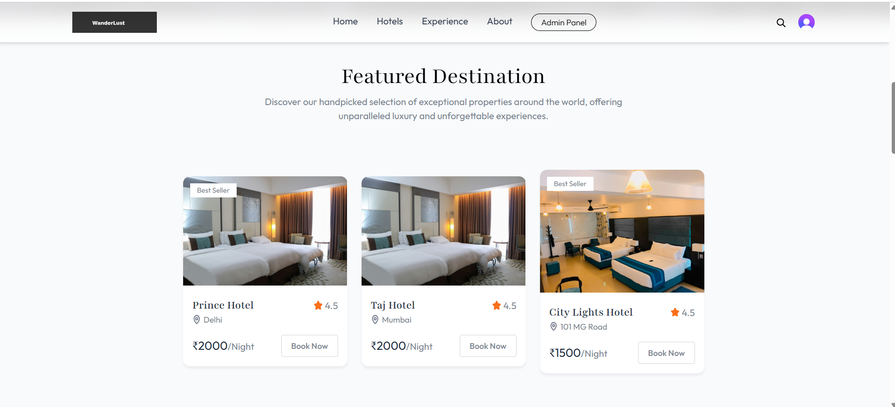 |

| Exclusive Offers | Rooms with Filters |
|---|---|
| 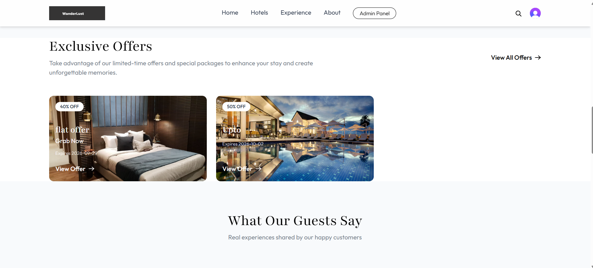 | 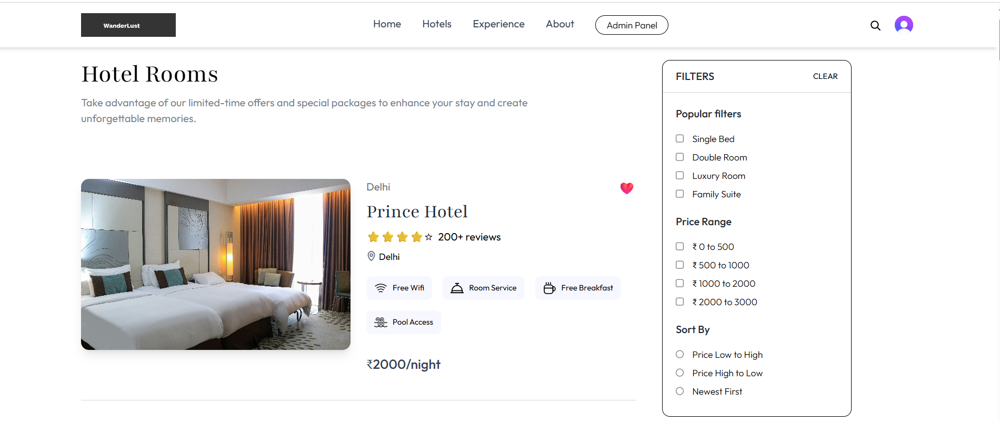 |

| Room Details | Location on Google Maps |
|---|---|
| 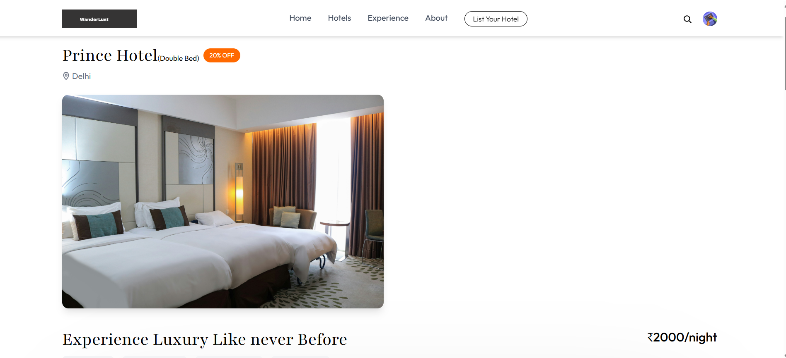 | 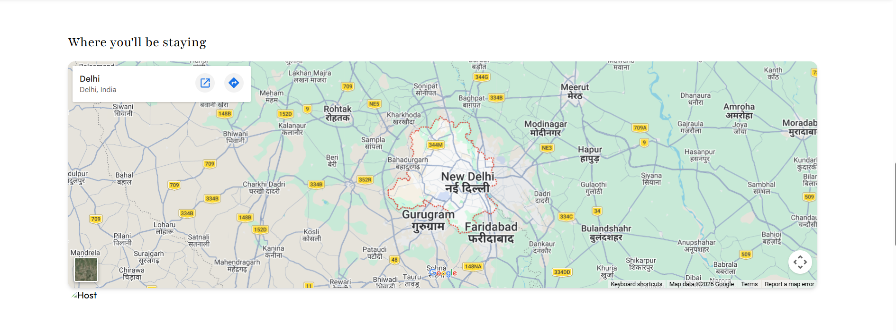 |

| Reviews | Wishlist |
|---|---|
| 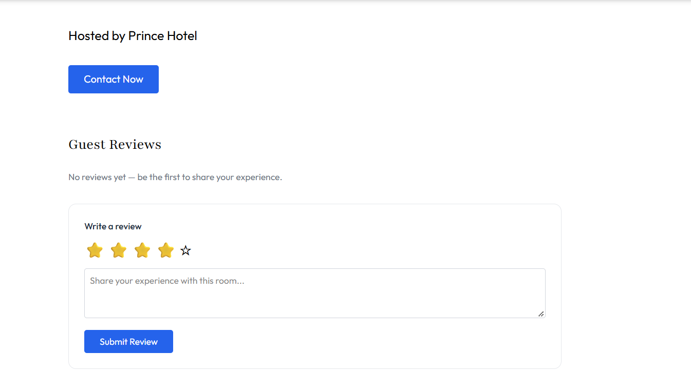 | 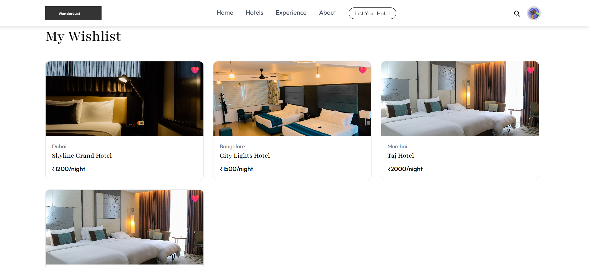 |

### Booking and payment

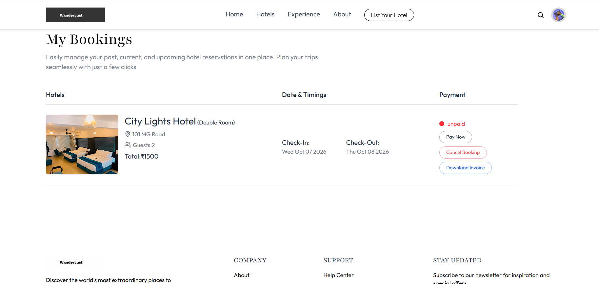

| Razorpay Checkout | Payment Successful |
|---|---|
| 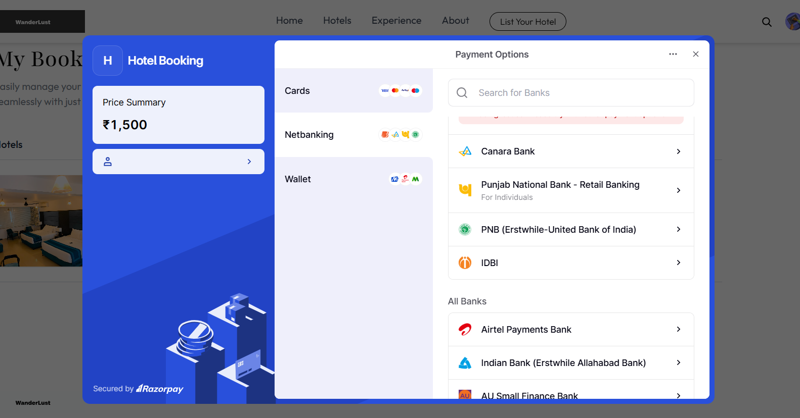 | 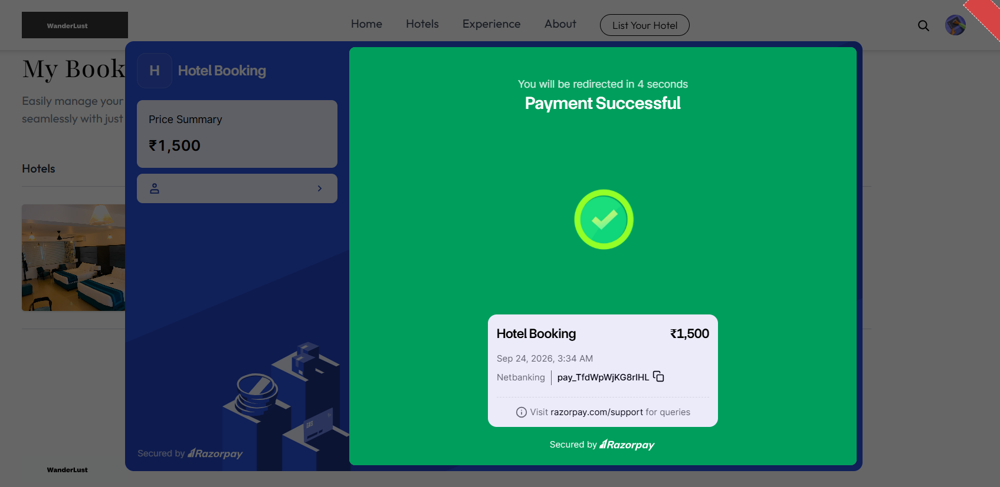 |

### Mobile

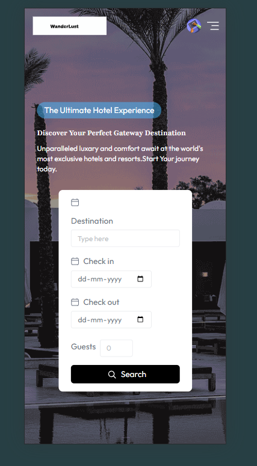

### Hotel Owner Dashboard

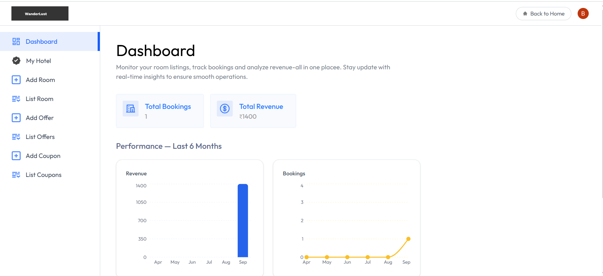
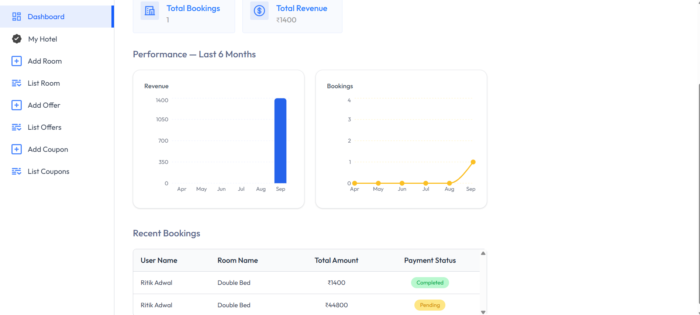

| My Hotel | Offers | Coupons |
|---|---|---|
| 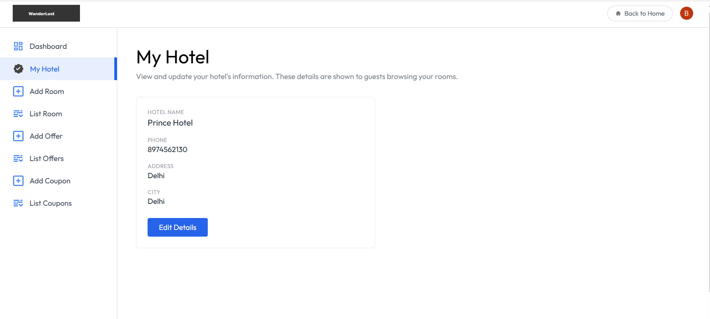 | 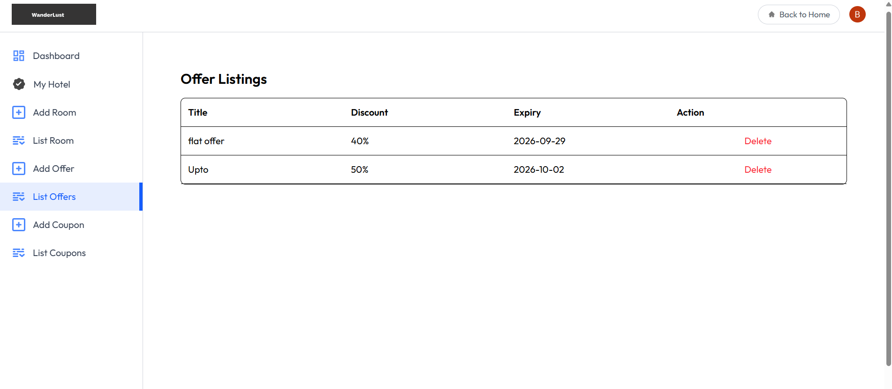 | 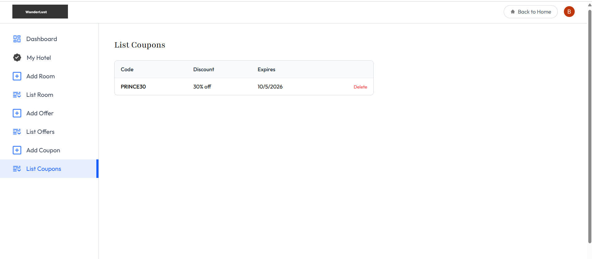 |

### Admin Panel

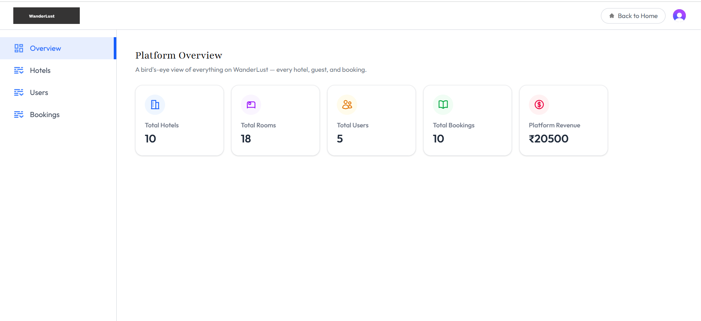

| Manage Hotels | Manage Bookings |
|---|---|
| 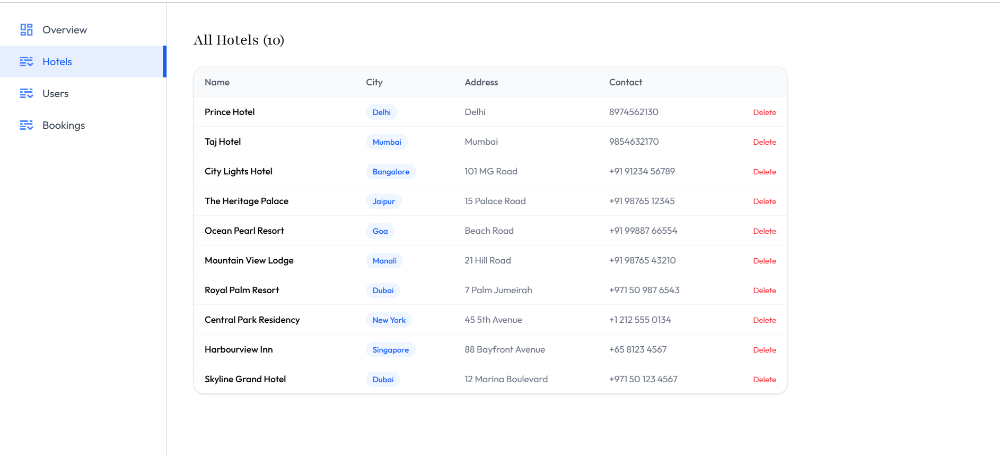 | 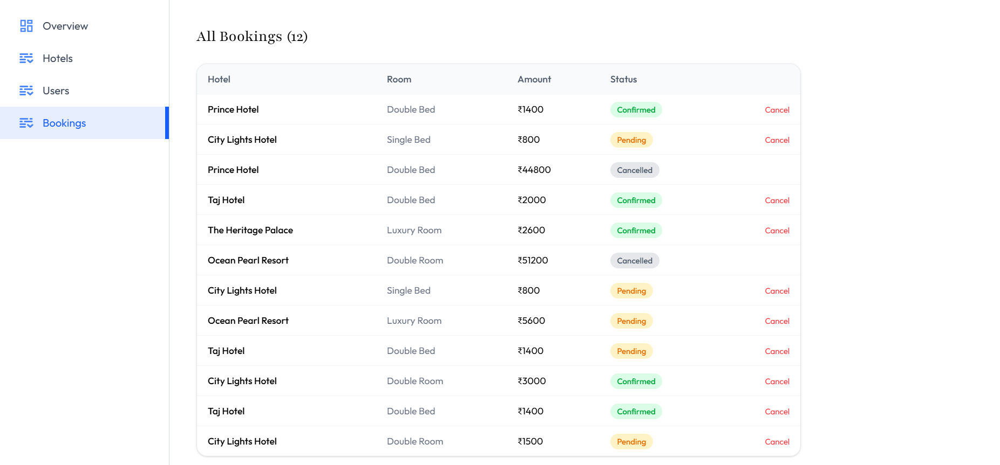 |

---

## 💡 The Idea

Booking a stay usually involves separate tools for each side: guests search on one platform, hotel owners track rooms and bookings somewhere else, and nobody has a single view of the whole system.

Stayora puts all three roles in one platform, so a guest can find and book a room, an owner can list rooms and track revenue, and an admin can oversee users, hotels and bookings.

## ✅ The Solution

A MERN application with **three role-based experiences**, secure authentication, online payments, cloud image hosting and email confirmations. The frontend and backend are deployed separately, the way production apps commonly are.

---

## ✨ Features

### 👤 Guests
- Search rooms by destination
- Filter by room type and price range, and sort by price or newest
- Room details with images, amenities, discount badge and a Google Maps location
- Room reviews and ratings
- Wishlist to save favourite rooms
- Exclusive offers and discount coupons
- Online payment with Razorpay
- Booking confirmation by email
- My Bookings page: pay later with Pay Now, cancel a booking, download an invoice
- Guest testimonials on the home page
- Responsive layout that works on mobile

### 🏨 Hotel Owners
- Register a hotel and edit its details (My Hotel)
- Add rooms with multi-image upload (Cloudinary)
- Dashboard with total bookings, total revenue and a 6-month performance chart
- Recent bookings table with guest name, room, amount and payment status
- Create and manage offers and coupons

### 🛡️ Admins
- Platform overview: total hotels, rooms, users, bookings and revenue
- View and delete hotels
- View all users and change their role (user, hotelOwner, admin) from the UI
- View and cancel bookings

### 🔐 Platform and Security
- Authentication with Clerk (Google and email)
- Clerk webhooks sync users to MongoDB, with a fallback that creates the user on the first authenticated API call
- Role-based route protection on the server (admin-only middleware) and on the client
- Rate limiting and secure HTTP headers (Helmet)
- Upload validation: image types only, 5 MB limit
- CORS restricted to the configured frontend origin
- Secrets kept in environment variables and out of Git history

---

## 🏗️ Architecture

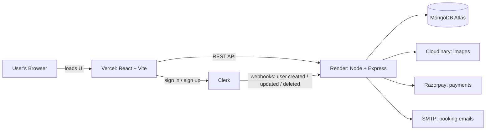

## 🛠️ Tech Stack

| Layer | Technology |
|---|---|
| Frontend | React (Vite), Tailwind CSS, Axios |
| Backend | Node.js, Express |
| Database | MongoDB Atlas with Mongoose |
| Auth | Clerk |
| Payments | Razorpay |
| Images | Cloudinary, Multer |
| Email | Nodemailer |
| Security | Helmet, express-rate-limit, CORS |
| Hosting | Vercel (frontend), Render (backend) |

## 🗂️ Data Models

`User` · `Hotel` · `Room` · `Booking` · `Coupon` · `RoomReview` · `Offer` · `Testimonial`

---

## 🚀 Run Locally

**Prerequisites:** Node.js 18+, a MongoDB Atlas cluster, and free accounts on Clerk, Cloudinary and Razorpay (test mode).

```bash
# 1. Clone
git clone https://github.com/Bhartendra-singh/Stayora-An-Accommodation-Booking-Platform.git
cd Stayora-An-Accommodation-Booking-Platform
```

**Backend**
```bash
cd server
npm install
cp .env.example .env     # then fill in your own values
node server.js
```

**Frontend** (in a second terminal)
```bash
cd client
npm install
cp .env.example .env     # then fill in your own values
npm run dev
```

**Optional: seed sample hotels and rooms**
```bash
cd server
node seed.js
```

### Environment Variables

**`server/.env`**

| Variable | Description |
|---|---|
| `MONGODB_URI` | MongoDB Atlas connection string, without a database name at the end |
| `CLERK_PUBLISHABLE_KEY` | Clerk publishable key |
| `CLERK_SECRET_KEY` | Clerk secret key |
| `CLERK_WEBHOOK_SECRET` | Signing secret of the Clerk webhook endpoint |
| `CLOUDINARY_CLOUD_NAME`, `CLOUDINARY_API_KEY`, `CLOUDINARY_API_SECRET` | Cloudinary credentials |
| `SENDER_EMAIL`, `SMTP_USER`, `SMTP_PASS` | Email sending via SMTP |
| `RAZORPAY_KEY_ID`, `RAZORPAY_KEY_SECRET` | Razorpay test keys |
| `CLIENT_URL` | Frontend URL allowed by CORS (for local use `http://localhost:5173`) |

**`client/.env`**

| Variable | Description |
|---|---|
| `VITE_BACKEND_URL` | Backend URL (for local use `http://localhost:3000`) |
| `VITE_CLERK_PUBLISHABLE_KEY` | Clerk publishable key |
| `VITE_CURRENCY` | Currency symbol shown in the UI (₹) |
| `VITE_RAZORPAY_KEY_ID` | Razorpay Key ID (public) |

### Clerk Webhook

Point a Clerk webhook to `https://<your-backend>/api/clerk` and subscribe to `user.created`, `user.updated` and `user.deleted`. Use its signing secret as `CLERK_WEBHOOK_SECRET`.

### Roles

New users start as `user`. Listing a hotel makes a user a `hotelOwner`. To create the first admin, set `role` to `"admin"` on that user in the database. After that, admins can change roles from the Admin Panel.

---

## ☁️ Deployment

| Part | Platform | Notes |
|---|---|---|
| Frontend | Vercel | Root directory `client`, framework Vite, SPA rewrite in `vercel.json` |
| Backend | Render | Root directory `server`, start command `node server.js` |
| Database | MongoDB Atlas | Network access opened for the hosted backend |

> This is a demo deployment: payments run in Razorpay **test mode** and authentication uses Clerk **development keys**.

---

## 🔮 Roadmap

- [ ] Clerk production instance with a custom domain
- [ ] Email delivery through a transactional email API
- [ ] Availability calendar to block already booked dates
- [ ] Automated tests for booking and payment flows

---

## 👨‍💻 Author

**Bhartendra Singh**

- GitHub: [@Bhartendra-singh](https://github.com/Bhartendra-singh)
- LinkedIn: [Bhartendra Singh](https://www.linkedin.com/in/bhartendra-singh-17764a282/)


